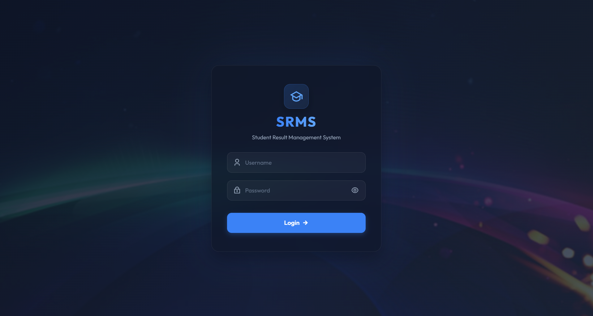
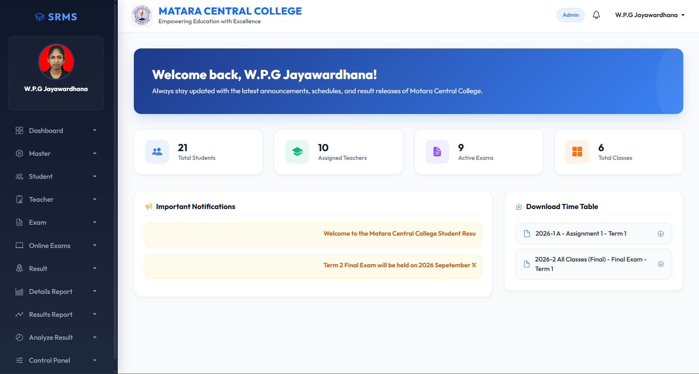
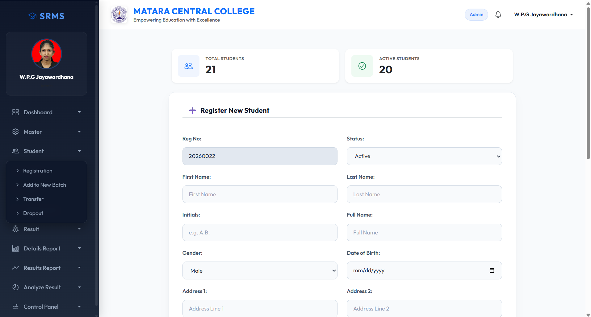

# Student Result Management System (SRMS)

A web-based **Student Result Management System** developed as an individual Final Year Project for the **Bachelor of Information Technology (BIT)** degree at the University of Colombo School of Computing.

## 📌 Project Overview

The Student Result Management System (SRMS) is a web-based application developed for **Matara Central College** to manage student academic information, examination results, attendance, approvals, and academic reports.

The system provides role-based access for administrators, teachers, students, and parents.

## 🎯 Objectives

* Manage student academic information efficiently.
* Manage grades, batches, classes, sections, subjects, terms, and examinations.
* Record and manage examination results.
* Manage assignment results and attendance.
* Provide an academic approval workflow.
* Generate academic reports.
* Implement role-based access control.
* Reduce manual work involved in managing student results.

## 👥 User Roles

### Administrator

* Manage users and system information.
* Manage academic configurations.
* Manage system privileges.

### Teacher

* Manage student academic information.
* Enter and manage examination results.
* Manage assignment results and attendance.
* Perform relevant approval activities.

### Student / Parent

* View student academic information.
* View examination results.
* View available academic reports.

## ✨ Main Features

### Student Management

* Student registration
* Student profile management
* Student profile photo management
* Grade, batch, class, and section management
* Student class and batch transfers

### Academic Management

* Grade management
* Batch management
* Class management
* Section management
* Subject management
* Term management
* Examination management

### Examination Results

* Examination result entry
* Subject-wise result management
* Final examination result management
* Assignment result management
* Assignment attendance management

### Approval Management

The system supports approval levels for selected academic operations, including:

* Class Teacher
* Section Head
* Batch Head
* Principal

### Reports

* Student result reports
* Examination reports
* Attendance reports
* Mark range reports
* Academic charts
* PDF report generation
* Excel report generation

## 🛠️ Technologies Used

### Frontend

* HTML
* CSS
* JavaScript
* Razor Views

### Backend

* C#
* ASP.NET MVC

### Database

* Microsoft SQL Server
* SQL Server Stored Procedures

### Reporting

* Crystal Reports

### Development Tools

* Microsoft Visual Studio 2012
* SQL Server Management Studio (SSMS)

## 🏗️ System Architecture

The application follows the **Model-View-Controller (MVC)** architectural pattern.

```text
User
 │
 ▼
View
(Razor / HTML / CSS / JavaScript)
 │
 ▼
Controller
(ASP.NET MVC / C#)
 │
 ▼
Application Logic
 │
 ▼
Stored Procedures
 │
 ▼
SQL Server Database
```

## 🗄️ Database

The project uses Microsoft SQL Server as the database management system.

Database name:

```text
SRMS_DB
```

Database operations are primarily handled using SQL Server Stored Procedures.

## 🔐 Security and Access Control

The system implements role-based access control to ensure that users can only access the modules and pages permitted for their assigned roles and privileges.

## 📊 Reporting

Crystal Reports is used to generate formatted academic reports.

Reports can be exported into formats such as:

* PDF
* Excel

## 📁 Project Structure

```text
SRMS/
│
├── Controllers/
├── Models/
├── Views/
├── Content/
├── Scripts/
├── Reports/
├── App_Data/
├── Web.config
└── README.md
```

## 🚀 Getting Started

### Prerequisites

* Visual Studio 2012 or compatible version
* .NET Framework compatible with the project
* Microsoft SQL Server
* SQL Server Management Studio
* Crystal Reports Runtime / Developer Components

### Database Setup

1. Create a database named `SRMS_DB`.
2. Execute the provided database scripts.
3. Create the required tables and stored procedures.
4. Configure the SQL Server connection string in `Web.config`.

### Running the Application

1. Clone this repository.

```bash
git clone <repository-url>
```

2. Open the solution file (`.sln`) in Visual Studio.
3. Configure the database connection.
4. Build the solution.
5. Run the application using Visual Studio.

## 📷 Screenshots
<h3>Login</h3>


<h3>Dashboard</h3>


<h3>Student Management</h3>



* Result Management
* Approval Management
* Reports

## 🎓 Academic Project

**Project Title:**
Student Result Management System

**Degree:**
Bachelor of Information Technology (BIT)

**University:**
University of Colombo School of Computing

**Institution:**
Matara Central College

**Project Type:**
Individual Final Year Project

## 👩‍💻 Developer

**Umasha Jayawardhana**

Bachelor of Information Technology (BIT)
University of Colombo School of Computing

## 📄 License

This project was developed for academic purposes.
